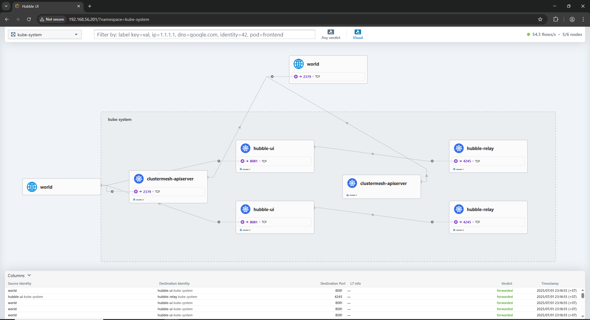

# 🔗 Cilium Cluster Mesh Setup Across Multiple Kubernetes Clusters
This repository demonstrates how to set up and verify **Cilium Cluster Mesh** between two Kubernetes clusters running on virtual machines.  It covers configuration of kubeconfigs, secure sharing of Cilium certificates, and establishing inter-cluster connectivity using `cilium clustermesh`.  Step-by-step scripts are provided to automate and validate each stage of the setup.  For detailed configuration and advanced options, please refer to the official [Cilium Cluster Mesh documentation](https://docs.cilium.io/en/stable/network/clustermesh/clustermesh/).

## 📦 Prerequisites
This repository manages two Kubernetes clusters, with separate scripts for each cluster and a shared script for all nodes.
All nodes run on virtual machines (VMs). Use the following scripts to perform cluster-wide or individual cluster operations:
- [command.sh — Commands for all nodes](https://github.com/EEM0N/Cluster-Mesh-Using-Cilium/blob/main/command.sh)
- [master-cluster1.sh — Cluster 1 specific commands](https://github.com/EEM0N/Cluster-Mesh-Using-Cilium/blob/main/master-cluster1.sh)
- [master-cluster2.sh — Cluster 2 specific commands](https://github.com/EEM0N/Cluster-Mesh-Using-Cilium/blob/main/master-cluster2.sh)

## 🧩 Multi-Cluster Context Setup
Ensure your kubeconfig file contains multiple cluster contexts. Below are example commands to verify the configuration:
```bash
vagrant@master-node-cluster1:~$ kubectl get nodes -o wide
NAME                     STATUS   ROLES           AGE   VERSION    INTERNAL-IP     EXTERNAL-IP   OS-IMAGE             KERNEL-VERSION       CONTAINER-RUNTIME
master-node-cluster1     Ready    control-plane   65m   v1.31.10   192.168.56.10   <none>        Ubuntu 22.04.4 LTS   5.15.0-102-generic   containerd://1.7.27
worker-node01-cluster1   Ready    <none>          62m   v1.31.10   192.168.56.11   <none>        Ubuntu 22.04.4 LTS   5.15.0-102-generic   containerd://1.7.27
worker-node02-cluster1   Ready    <none>          62m   v1.31.10   192.168.56.12   <none>        Ubuntu 22.04.4 LTS   5.15.0-102-generic   containerd://1.7.27

vagrant@master-node-cluster2:~$ kubectl get nodes -o wide
NAME                     STATUS   ROLES           AGE   VERSION    INTERNAL-IP     EXTERNAL-IP   OS-IMAGE             KERNEL-VERSION       CONTAINER-RUNTIME  
master-node-cluster2     Ready    control-plane   54m   v1.31.10   192.168.56.20   <none>        Ubuntu 22.04.4 LTS   5.15.0-102-generic   containerd://1.7.27
worker-node01-cluster2   Ready    <none>          53m   v1.31.10   192.168.56.21   <none>        Ubuntu 22.04.4 LTS   5.15.0-102-generic   containerd://1.7.27
worker-node02-cluster2   Ready    <none>          53m   v1.31.10   192.168.56.22   <none>        Ubuntu 22.04.4 LTS   5.15.0-102-generic   containerd://1.7.27
```

### 🔧 Configure Kubeconfig for Each Cluster
For each cluster's kubeconfig, you need to update the following fields to ensure proper identification and separation:
- **Cluster name**
- **Context name**
- **User name**

In this example, we use the following naming convention:
- **Cluster:** `cluster-1`  
- **Context:** `cluster-1-context`  
- **User:** `cluster-1-user`

> **Note:** You can also manually update these naming conventions directly in the kubeconfig file if preferred.

Use the following commands to extract and set user credentials:
```bash
# Extract and decode the client certificate
kubectl config view --raw -o jsonpath='{.users[?(@.name=="kubernetes-admin")].user.client-certificate-data}' | base64 -d > /tmp/cluster-1-client.crt

# Extract and decode the client key
kubectl config view --raw -o jsonpath='{.users[?(@.name=="kubernetes-admin")].user.client-key-data}' | base64 -d > /tmp/cluster-1-client.key

# Set the user credentials for cluster-1
kubectl config set-credentials cluster-1-user \
  --client-certificate=/tmp/cluster-1-client.crt \
  --client-key=/tmp/cluster-1-client.key \
  --embed-certs=true
```

### 🔧 Merged kubeconfig file containing access to all clusters
```bash
KUBECONFIG=.kube/config-1:.kube/config-2 kubectl config view --flatten > .kube/merged-config
export KUBECONFIG=.kube/merged-config
```

### 
Ensure your kubeconfig file contains multiple cluster contexts. Below are example commands to verify the configuration:
```bash
vagrant@master-node-cluster1:~$ kubectl config get-contexts --kubeconfig=.kube/merged-config
CURRENT   NAME                CLUSTER     AUTHINFO         NAMESPACE
*         cluster-1-context   cluster-1   cluster-1-user
          cluster-2-context   cluster-2   cluster-2-user
```

### 
```bash
vagrant@master-node-cluster1:~$ kubectl config get-clusters --kubeconfig=.kube/merged-config
NAME
cluster-1
cluster-2
```

### 🔁 Share Cilium CA Between Clusters
To enable cluster mesh connectivity, you need to copy the `cilium-ca` secret from **Cluster 1** and apply it to **Cluster 2**.
#### 📤 Export `cilium-ca` from Cluster 1 and apply it to Cluster 2

```bash
# Export the cilium-ca secret from Cluster 1
kubectl get secret cilium-ca -n kube-system -o yaml > cilium-ca.yaml

# Apply the exported secret to Cluster 2
kubectl replace -f cilium-ca.yaml -n kube-system --force
```

### 🔗 Connecting Clusters
To establish Cluster Mesh connectivity between the two clusters, use the `cilium clustermesh connect` command.  
This will automatically exchange secrets and configure mutual trust between the clusters.

```bash
vagrant@master-node-cluster1:~$ cilium clustermesh connect --context cluster-1-context --destination-context cluster-2-context  
✨ Extracting access information of cluster cluster-1...
🔑 Extracting secrets from cluster cluster-1...
ℹ️  Found ClusterMesh service IPs: [192.168.56.200]
✨ Extracting access information of cluster cluster-2...
🔑 Extracting secrets from cluster cluster-2...
ℹ️  Found ClusterMesh service IPs: [192.168.56.100]
ℹ️ Configuring Cilium in cluster cluster-1 to connect to cluster cluster-2
ℹ️ Configuring Cilium in cluster cluster-2 to connect to cluster cluster-1
✅ Connected cluster cluster-1 <=> cluster-2!
```
```bash
vagrant@master-node-cluster2:~$ cilium clustermesh connect --context cluster-2-context --destination-context cluster-1-context  
✨ Extracting access information of cluster cluster-2...
🔑 Extracting secrets from cluster cluster-2...
ℹ️  Found ClusterMesh service IPs: [192.168.56.100]
✨ Extracting access information of cluster cluster-1...
🔑 Extracting secrets from cluster cluster-1...
ℹ️  Found ClusterMesh service IPs: [192.168.56.200]
ℹ️ Configuring Cilium in cluster cluster-2 to connect to cluster cluster-1
ℹ️ Configuring Cilium in cluster cluster-1 to connect to cluster cluster-2
✅ Connected cluster cluster-2 <=> cluster-1!
vagrant@master-node-cluster2:~$ 
```
> **Note:** Make sure both clusters are running Cilium with Cluster Mesh support enabled and are reachable from each other before running this command.

### ✅ Check Cluster Mesh Status

Once both clusters are connected, you can verify the Cluster Mesh status using the `cilium clustermesh status` command.  
This command confirms service availability, KVStore mesh connectivity, and the status of inter-cluster connections.

```bash
vagrant@master-node-cluster1:~$ cilium clustermesh status
✅ Service "clustermesh-apiserver" of type "LoadBalancer" found
✅ Cluster access information is available:
  - 192.168.56.200:2379
✅ Deployment clustermesh-apiserver is ready
ℹ️  KVStoreMesh is enabled

✅ All 3 nodes are connected to all clusters [min:1 / avg:1.0 / max:1]
✅ All 1 KVStoreMesh replicas are connected to all clusters [min:1 / avg:1.0 / max:1]     

🔌 Cluster Connections:
  - cluster-2: 3/3 configured, 3/3 connected - KVStoreMesh: 1/1 configured, 1/1 connected

🔀 Global services: [ min:0 / avg:0.0 / max:0 ]
```
```bash
vagrant@master-node-cluster2:~$ cilium clustermesh status 
✅ Service "clustermesh-apiserver" of type "LoadBalancer" found
✅ Cluster access information is available:
  - 192.168.56.100:2379
✅ Deployment clustermesh-apiserver is ready
ℹ️  KVStoreMesh is enabled

✅ All 3 nodes are connected to all clusters [min:1 / avg:1.0 / max:1]
✅ All 1 KVStoreMesh replicas are connected to all clusters [min:1 / avg:1.0 / max:1]     

🔌 Cluster Connections:
  - cluster-1: 3/3 configured, 3/3 connected - KVStoreMesh: 1/1 configured, 1/1 connected

🔀 Global services: [ min:0 / avg:0.0 / max:0 ]

vagrant@master-node-cluster2:~$ 
```
### 🔍 Test Cluster Connectivity

To verify cluster connectivity through Cilium Cluster Mesh, apply the example global service manifests on both clusters:

```bash
kubectl apply -f https://raw.githubusercontent.com/cilium/cilium/v1.13/examples/kubernetes/clustermesh/global-service-example/cluster1.yaml
kubectl apply -f https://raw.githubusercontent.com/cilium/cilium/v1.13/examples/kubernetes/clustermesh/global-service-example/cluster2.yaml
```
#### Cluster 1 
```bash
vagrant@master-node-cluster1:~$ kubectl exec -ti deployment/x-wing -- bash
root@x-wing-66f7489d8-5ckmn:/# curl rebel-base
{"Galaxy": "Alderaan", "Cluster": "Cluster-2"}
root@x-wing-66f7489d8-5ckmn:/# curl rebel-base
{"Galaxy": "Alderaan", "Cluster": "Cluster-1"}
root@x-wing-66f7489d8-5ckmn:/# curl rebel-base
{"Galaxy": "Alderaan", "Cluster": "Cluster-1"}
root@x-wing-66f7489d8-5ckmn:/# curl rebel-base
{"Galaxy": "Alderaan", "Cluster": "Cluster-2"}
root@x-wing-66f7489d8-5ckmn:/# curl rebel-base
{"Galaxy": "Alderaan", "Cluster": "Cluster-1"}
root@x-wing-66f7489d8-5ckmn:/# curl rebel-base
{"Galaxy": "Alderaan", "Cluster": "Cluster-2"}
root@x-wing-66f7489d8-5ckmn:/# curl rebel-base
{"Galaxy": "Alderaan", "Cluster": "Cluster-1"}
root@x-wing-66f7489d8-5ckmn:/# 
```
#### Cluster 2
```bash
vagrant@master-node-cluster2:~$ kubectl exec -ti deployment/x-wing -- bash
root@x-wing-66f7489d8-t266q:/# curl rebel-base
{"Galaxy": "Alderaan", "Cluster": "Cluster-1"}
root@x-wing-66f7489d8-t266q:/# curl rebel-base
{"Galaxy": "Alderaan", "Cluster": "Cluster-1"}
root@x-wing-66f7489d8-t266q:/# curl rebel-base
{"Galaxy": "Alderaan", "Cluster": "Cluster-1"}
root@x-wing-66f7489d8-t266q:/# curl rebel-base
{"Galaxy": "Alderaan", "Cluster": "Cluster-2"}
root@x-wing-66f7489d8-t266q:/# curl rebel-base
{"Galaxy": "Alderaan", "Cluster": "Cluster-1"}
root@x-wing-66f7489d8-t266q:/# curl rebel-base
{"Galaxy": "Alderaan", "Cluster": "Cluster-2"}
root@x-wing-66f7489d8-t266q:/# curl rebel-base
{"Galaxy": "Alderaan", "Cluster": "Cluster-2"}
root@x-wing-66f7489d8-t266q:/# curl rebel-base
{"Galaxy": "Alderaan", "Cluster": "Cluster-2"}
root@x-wing-66f7489d8-t266q:/# curl rebel-base
{"Galaxy": "Alderaan", "Cluster": "Cluster-2"}
root@x-wing-66f7489d8-t266q:/# 
```

```bash
vagrant@master-node-cluster1:~$ kubectl get svc -n kube-system
NAME                            TYPE           CLUSTER-IP      EXTERNAL-IP      PORT(S)                      AGE
cilium-envoy                    ClusterIP      None            <none>           9964/TCP                     115m
clustermesh-apiserver           LoadBalancer   10.129.157.74   192.168.56.200   2379:30376/TCP               115m
clustermesh-apiserver-metrics   ClusterIP      None            <none>           9962/TCP,9964/TCP,9963/TCP   115m
hubble-peer                     ClusterIP      10.129.75.114   <none>           443/TCP                      115m
hubble-relay                    ClusterIP      10.129.233.80   <none>           80/TCP                       115m
hubble-ui                       LoadBalancer   10.129.124.3    192.168.56.201   80:31440/TCP                 115m
kube-dns                        ClusterIP      10.129.0.10     <none>           53/UDP,53/TCP,9153/TCP       115m
```

### 📊 Cluster Connectivity Visualization

The figure below shows the cluster connectivity in the Hubble UI:


